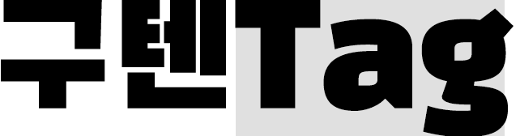
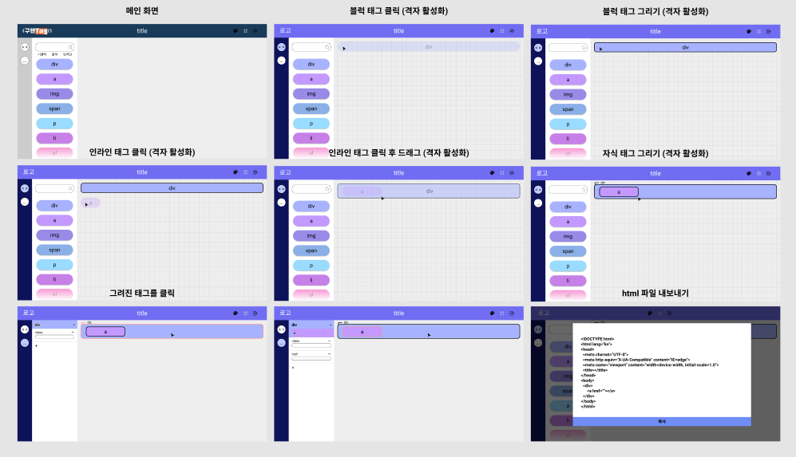
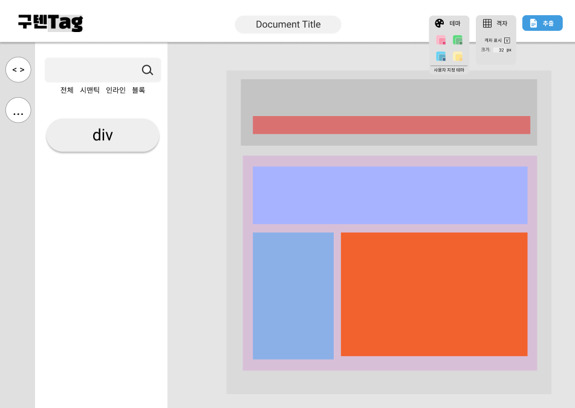

# 구텐Tag - HTML Markup Generator
- 구텐Tag은 HTML 구조를 보드에 그려나가는 방식의 마크업 작성 서비스입니다.

## 1. 목표와 기능
### 1.1 목표
- 대상 : HTML 입문자 및 시멘틱(sementic)한 구조의 마크업 작성을 고려하는 사람들
- 목적 : HTML 교육용 및 마크업 작성 기획용
- 특징 : 마크업의 시각화
- 주요 키워드 : 직관적, 편리성
### 1.2 기능
- 기본적인 HTML 문서 구조를 시각적으로 그려나가며 파악할 수 있습니다.
- block 요소와 inline 요소로 구성된 태그들의 속성을 자연스럽게 인지하고 습득할 수 있습니다.
- 웹 접근성과 SEO를 위한 시멘틱 요소를 사용해 봄으로써 문서 가독성의 증가를 체감할 수 있습니다.
- 시각적으로 그린 결과물을 HTML 코드로 간편하게 추출할 수 있습니다.

## 2. 배포
### 2.1 배포 일정
- 2022년 1월 6일 예정
### 2.2 배포 URL
- ~~www.구텐tag.com~~

## 3. 팀 소개 및 역할 분담
### 3.1 팀 소개
- 팀명 : 자-멘
- 팀장 : 임준홍
- 팀원 : 김민찬, 윤수영, 이종원
- 멋쟁이 사자처럼 프론트엔드 스쿨 1기 멋사토피아 스터디
### 3.2 역할 분담
- 기획 : 임준홍, 김민찬
- JavaScript : 임준홍(보드 메인기능), 이종원, 김민찬, 윤수영
- HTML/CSS : 김민찬(보드), 윤수영(인덱스, 보드), 이종원(보드)
- 디자인 : 임준홍, 윤수영

## 4. 프로젝트 구조와 개발 일정
### 4.1 프로젝트 구조
```bash
** Guten-Tag **
│  index.html
│  board.html
│
├─.github
│  └─ISSUE_TEMPLATE
│          ---bug-report.md
│          --feature-request.md
│
├─css
│      boardStyle.css
│      font.css
│      indexStyle.css
│      reset.css
│
└─js
       aside.js
       attrBtn.js
       attrCustom.js
       board.js
       cursor.js
       data.js
       grid.js
       menuOpen.js
       modal.js
       renderTags.js
       searchFilter.js
       tag.js
       util.js
```
### 4.2 개발 일정
- 메인 프로젝트 기간 : 2021.12.17 - 2022.01.02
- 추후 지속적으로 기능 보완

## 5. 로고 / UI
### 5.1 로고


### 5.2 UI
- 초기 기획안<br>
<br>
- UI<br>

## 6. 메인 기능
## 7. 개발하며 느낀 점
